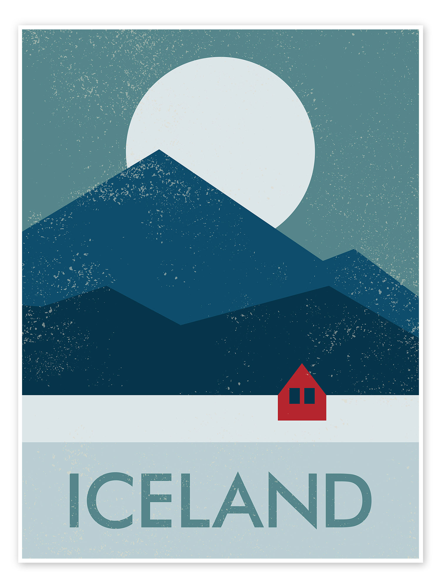

```{r setup, include=FALSE}
knitr::opts_chunk$set(echo = TRUE)

library(tidyverse)
library(leaflet)
library(leafpop)
library(leaflet.mapboxgl)
```

<center>

{height="500"}

#### March 16, 2024 - March 23, 2024

```{r echo = FALSE}
leaflet() %>% 
  addTiles() %>%
  setView(lng = -19.0208, lat = 64.9631, zoom = 6) %>% 
  addMarkers(
    lng = -22.6755, lat = 63.8683,
    popup = sprintf("<strong>The Bridge Between Continents</strong><br/>") %>% 
      lapply(htmltools::HTML)
  )
```

</center>
